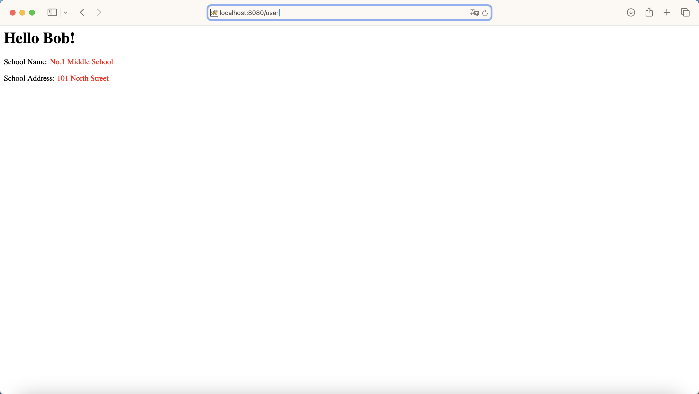
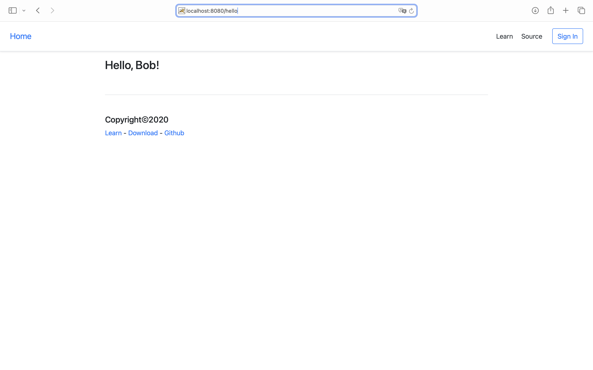

# wk2-mvc
- https://www.liaoxuefeng.com/wiki/1252599548343744/1266264917931808
- https://www.liaoxuefeng.com/wiki/1252599548343744/1337408645759009

MVC(Model-View-Controller) by its name divides an application into three parts: Model, View, and Controller, each with specific responsibilities and roles. Here we run mvc tutorials, as followed by the Fig.1-2 below.

    
    
Fig.1 MVC

    
    
Fig.2 MVC High

